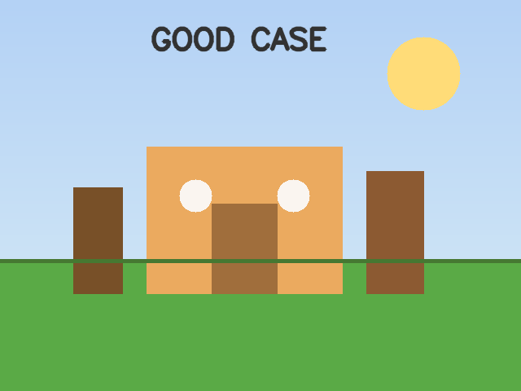
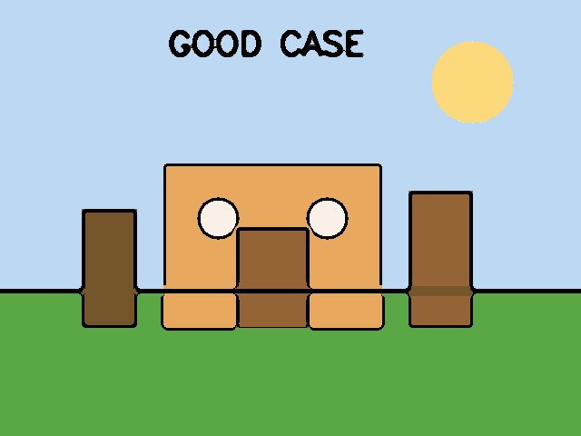
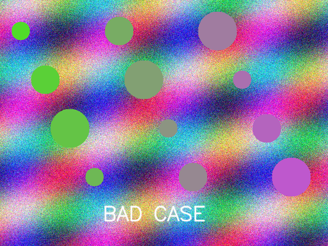
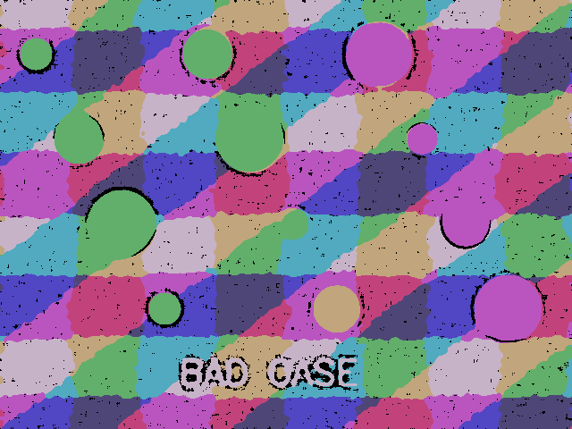

# Homework #2 - Cartoon Rendering

## 1. 과제 목표

OpenCV 기반 이미지 처리 기법을 사용하여 입력 이미지를 만화 스타일(cartoon style)로 변환한다.

## 2. 구현 방법

본 프로젝트의 알고리즘은 다음 순서로 동작한다.

1. 입력 이미지를 grayscale로 변환한 뒤 median blur를 적용해 작은 노이즈를 줄인다.
2. Adaptive Threshold를 사용해 만화 느낌의 검은 윤곽선(edge mask)을 추출한다.
3. Bilateral Filter를 여러 번 적용해 경계는 유지하면서 색 영역을 부드럽게 만든다.
4. K-means 색상 양자화(color quantization)로 색상 수를 줄여 단순한 만화 팔레트를 만든다.
5. 마지막으로 윤곽선 마스크와 양자화된 컬러 이미지를 결합해 만화 스타일 결과를 생성한다.

## 3. 실행 방법

### 만화 스타일 변환 실행

```bash
python3 cartoon_render.py <입력이미지경로> <출력이미지경로>
```

예시:

```bash
python3 cartoon_render.py images/input/good_input.png results/my_cartoon.png
```

기본 실행 시 원본 이미지와 만화 변환 결과가 하나의 OpenCV 창에서 가로로 이어진 비교 화면으로 표시된다. 이미 같은 출력 파일이 존재하면 덮어쓰지 않고 기존 결과 이미지를 다시 보여준다.

UI 창 없이 실행만 하고 싶다면 아래처럼 `--no-ui` 옵션을 사용할 수 있다.

```bash
python3 cartoon_render.py images/input/Me.jpg images/output/me_cartoon.png --no-ui
```

### README 데모 이미지 재생성

```bash
python3 generate_demo_assets.py
```

## 4. 데모

### 4.1 만화 느낌이 잘 표현되는 경우

입력 이미지:



출력 이미지:



설명:
영역이 비교적 단순하고, 색상 경계가 분명하며, 물체의 윤곽이 또렷한 이미지에서는 만화 스타일이 잘 드러난다. 하늘, 집, 나무처럼 큰 색 영역으로 나뉜 장면은 bilateral filtering과 color quantization의 효과가 잘 나타난다.

### 4.2 만화 느낌이 잘 표현되지 않는 경우

입력 이미지:



출력 이미지:



설명:
복잡한 텍스처, 강한 노이즈, 불규칙한 색 변화가 많은 이미지에서는 윤곽선이 과도하게 생기고 세부 정보가 뭉개져 결과가 어색해질 수 있다.

## 5. 알고리즘의 한계점

1. 텍스처가 많은 이미지에 취약하다.
사진 내부에 잔디, 머리카락, 천 무늬, 노이즈처럼 고주파 성분이 많으면 edge가 너무 많이 검출되어 결과가 지저분해진다.

2. 조명이 복잡한 경우 경계가 부정확해질 수 있다.
그림자와 하이라이트가 강한 사진에서는 실제 물체 경계가 아닌 밝기 변화까지 윤곽선처럼 검출될 수 있다.

3. 파라미터 민감도가 있다.
Adaptive Threshold, Bilateral Filter, K-means 클러스터 수 값에 따라 결과 품질이 크게 달라질 수 있다. 모든 이미지에 동일하게 최적인 파라미터를 적용하기는 어렵다.

4. 매우 사실적인 사진에는 한계가 있다.
인물 피부, 세밀한 배경, 복잡한 원근 구조가 포함된 실제 사진에서는 고급 비학습 기반 스타일 변환보다 성능이 제한적이다.

## 6. 파일 구성

- `cartoon_render.py`: 입력 이미지를 만화 스타일로 변환하는 메인 코드
- `generate_demo_assets.py`: README용 데모 입력/출력 이미지를 자동 생성하는 스크립트
- `images/input/`: 데모 입력 이미지
- `images/output/`: 데모 결과 이미지
